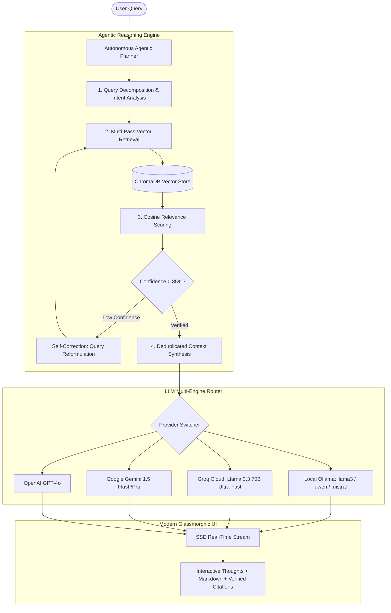

# 🚀 Deep Doc Query — Autonomous Agentic RAG Platform

> An enterprise-grade, high-performance **Agentic Retrieval-Augmented Generation (RAG)** platform featuring multi-vector query decomposition, self-corrective retrieval (**CRAG**), multi-format document ingestion, real-time reasoning visualization, and multi-provider LLM support (Local Ollama, Groq Cloud, Google Gemini, OpenAI).

---

## 🌟 Key Architecture & Superpowers



---

## ⚡ Feature Matrix

| Feature | Standard RAG | **Deep Doc Query (Agentic RAG v2)** |
| :--- | :--- | :--- |
| **Retrieval Strategy** | 1-shot naive Top-K | **Multi-vector query decomposition + Self-Correcting CRAG** |
| **Confidence Scoring** | None | **Exact similarity match score per chunk (e.g. 94% Match)** |
| **Supported File Formats** | `.md`, `.pdf` only | **`.pdf`, `.docx`, `.md`, `.txt`, `.csv`, `.json`, `.py`, `.js`, `.ts`, `.cpp`** |
| **Document Management** | Full database reset | **Granular deletion, chunk inspector, and incremental indexing** |
| **LLM Inference Options** | Hardcoded Localhost | **Local Ollama (100% Private) + Cloud (Groq, Gemini, OpenAI)** |
| **User Experience** | Plain text box | **Live Agent Thought Stream, Copyable Code Blocks, Session Export** |

---

## 🛠️ Project Structure

```
├── backend/
│   ├── modules/
│   │   ├── agent.py          # Agentic RAG Engine: decomposition, CRAG, multi-provider LLM streaming
│   │   ├── ingestor.py       # Multi-format document parser, chunker, and ChromaDB manager
│   │   ├── retriever.py      # Vector similarity & scoring helper
│   │   └── generator.py      # Grounded context prompt builder
│   ├── docs/                 # Document storage directory
│   ├── data/chroma/          # Persistent ChromaDB vector store
│   ├── main.py               # FastAPI server with SSE streaming & document endpoints
│   └── requirements.txt      # Backend Python dependencies
├── frontend/
│   ├── src/
│   │   ├── components/
│   │   │   ├── AgentReasoningCard.jsx  # Live agent thoughts & reasoning visualizer
│   │   │   ├── CitationModal.jsx       # Interactive citation pills & snippet preview
│   │   │   ├── CodeBlock.jsx           # Syntax-highlighted code block with copy button
│   │   │   ├── KnowledgeBaseModal.jsx  # Document library, multi-file upload, chunk inspector
│   │   │   ├── ModelSettingsModal.jsx  # Multi-provider & model parameters drawer
│   │   │   └── Sidebar.jsx             # Chat thread management, search, and Markdown export
│   │   ├── App.jsx                     # Master application orchestrator
│   │   └── index.css                   # Glassmorphic dark design system & glowing styles
│   ├── package.json
│   └── vite.config.js
└── render.yaml                         # Deployment configuration for backend
```

---

## 🚀 Quickstart Guide

### 1. Backend Setup

```bash
cd backend
python -m pip install -r requirements.txt
python -m uvicorn main:app --reload --port 8000
```

- API Docs: `http://127.0.0.1:8000/docs`
- Health check: `http://127.0.0.1:8000/health`

### 2. Frontend Setup

```bash
cd frontend
npm install
npm run dev
```

- Frontend App: `http://localhost:5173`

---

## ☁️ Cloud & Vercel Deployment

1. **Frontend (Vercel)**:
   - Connect your GitHub repo to Vercel.
   - Set Root Directory to `frontend`.
   - Set Environment Variable `VITE_API_BASE_URL` to your deployed backend URL.

2. **Backend (Render / Railway / Cloud Run)**:
   - Deploy `backend/` using Docker or Python runtime (`render.yaml` included).
   - Configure optional environment variables:
     - `GROQ_API_KEY`: For instant high-speed cloud inference.
     - `GEMINI_API_KEY` or `OPENAI_API_KEY`.

---

## 📜 License

MIT License. Designed with ❤️ for cutting-edge local & cloud RAG intelligence.
